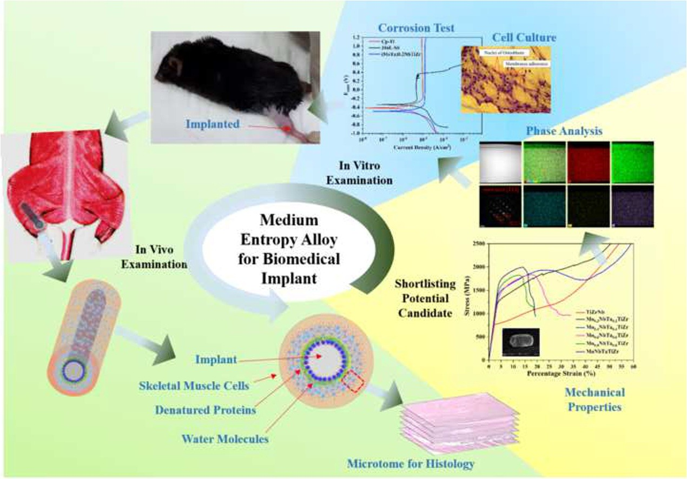
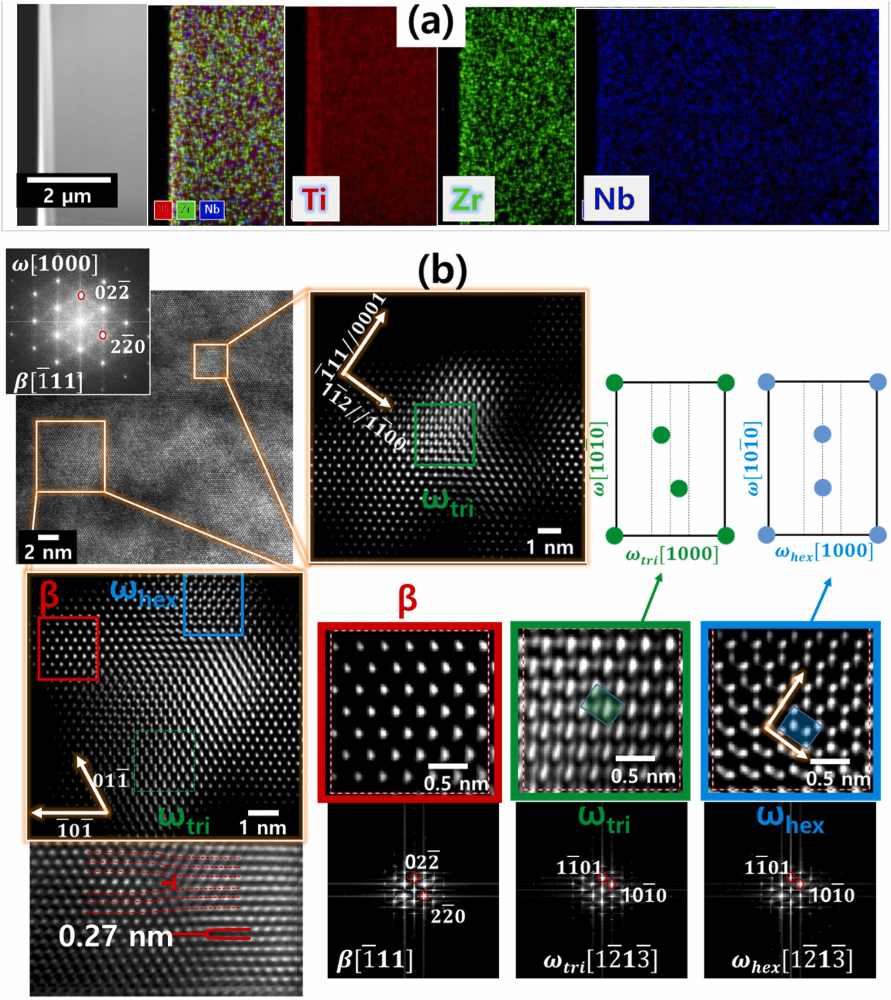

# Materials Scientist/  R&D
#### +82-010-7545-1991
#### muhammad.akmal@alumni.kaist.ac.kr

## OBJECTIVE STATEMENT
-	Dynamic Ph.D. graduate in Materials Science & Engineering from KAIST, offering a decade of expertise in designing, fabricating, and characterizing advanced alloys, ceramics, and composites. Proven skills encompass alloy design, additive manufacturing using DED, and cold sintering of ceramics. Aspiring to apply machine learning in materials discovery. Seeking opportunities to drive innovation for diverse applications, including biomedical, waste immobilization, high-temperature, and plasma-facing environments within a lead R&D role. Published in esteemed journals, dedicated to creating cutting-edge products for a sustainable future.

## EDUCATION 

#### Ph.D. in Materials Science and Engineering (2018 – 2022)
Korea Advanced Institute of Science and Technology [(KAIST)](https://www.kaist.ac.kr/en/), Daejeon, South Korea
  **Thesis**: Design and Characterization of High and Medium Entropy Alloys for Biomedical Implants
  **Supervisor**: Prof. Ho Jin Ryu
  
#### MS in Nanotechnology and Materials Engineering (2013 – 2015)
GIK Institute of Engineering Sciences and Technology [(GIKI)](https://www.giki.edu.pk/), Topi, 23460, Pakistan
**Thesis**: Fabrication and Characterization of 316L/HA Functionally Graded Materials for Biomedical Implants. Supervisor: Prof. Fazal Ahmad Khalid

#### B.Sc in Metallurgy and Materials Engineering (2008 – 2012)
Bahauddin Zakariya University [(BZU)](https://www.bzu.edu.pk/), Multan, Pakistan
**FYP**: Effect of Ni on Hypo-eutectoid Steels

## PROFESSIONAL CAREER 
**Senior Researcher | Department of High-Temperature Materials | [KIMS](https://www.kims.re.kr/?lang=en), South Korea (Sep 2023- Date)**
-	Investigated metal-mold reactions and related MC carbide growth in directionally solidified Ni-based superalloys (CM247LC; CMSX-4; GTD-111; René N5; IN738) for improvement in the casting processes. 
-	Examining laser welding of dissimilar (Hastelloy-X and Inconel 939) superalloys for refurbishment and repair of the steam turbine engine components like vanes and blades

**Postdoctoral Researcher | Nuclear Fuel Materials Lab (NFML) | KAIST, South Korea (Sep 2022- Sep 2023)**
-	Designed and analyzed additive manufacturing of BCC medium entropy alloys (MEAs)/ β-Ti alloys using DED; among the first studies reported that utilized DED for β-Ti alloys and achieved significant mechanical properties.
-	Implemented electrically assisted pressured joining techniques for dissimilar alloys: Ti64-(TiZrNb)MoTa0.1 MEAs for potential application in making blisks (bladed disks) of turbine engines.
	Supervised and mentored a senior-year undergraduate student of MSE for the final-year project.

**Research Assistant|Nuclear Fuel Materials Lab (NFML), NQE | KAIST, South Korea (Aug 2018-Aug 2022)**
-	Designed and characterized BCC high and medium entropy alloys (HEAs & MEAs) for biomedical applications, by tailoring composition and microstructure to improve ductility of TiZrNbMoTa alloy system, utilizing arc melting, powder metallurgy, and spark plasma sintering. Reported first in-vivo examination of a HEA in skeletal muscle of mice.
-	Explored cold sintering of ceramics and nanocomposites for waste immobilization and biomedical applications. Deviced a new way of sintering ceramics like Hydroxyapatite, Alumina, Zeolite, Bio–rGO, and Zirconia at as low a temperature as 150o C that can be used to capture radioactive ions for nuclear waste management.

**Visiting Researcher | Nuclear Fuel Materials Lab [(NFML)](https://fuel.kaist.ac.kr/), NQE | KAIST, South Korea (Feb 2018-Aug 2018)**
-	Prepared TiZrNbMoTa HEAs using mechanical alloying and spark plasma sintering.
-	Utilized Spark Plasma Sintering and Cold Sintering techniques for ceramics composites.

**Materials Engineer | GIK Institute of Engineering Sciences and Technology | GIKI, Pakistan (Jan 2016 – Aug 2017)**
-	Official Lab operator of Atomic Force Microscopy for nanofilms, nanocomposites, and sensors.
-	Assisted in undergraduate courses: MM222 (Strength of Materials), MM231 (Phase Equilibria), MM221 (Materials Evaluation Techniques), MM463 (Electronics and Magnetic Materials), and MM451 (Corrosion and Protection).
-	Conducted Nanotechnology and Materials Engineering Labs for senior and sophomore students.
-	Co-supervised final-year design projects.

**Lab Instructor | Physics Department Lahore University of Management Sciences | [(LUMS)](https://lums.edu.pk/), Pakistan (Oct 2015 – Dec 2015)**
-	Conducted Phy-100 lab for Fall 2015 as one of the instructors on innovative physics experiments.
-	Updated student helping manuals and organized the 3rd annual open house in Fall 2015 at the Physics department with the physics lab team at LUMS Lahore, Pakistan.

**Graduate Assistant | GIK Institute of Engineering Sciences and Technology | GIKI, Pakistan (Jan 2013 – Jan 2015)**
-	Conducted labs for freshmen, junior, and senior students: Introductory lab to Materials Engineering (MM141L); Polymer Science & Engineering (MM345L); Metallography, Heat Treatment and Casting (MM344L); Powder Metallurgy (MM447L); and, Sintering Techniques & Composite Fabrication (MM446L)
-	Assisted professors in teaching courses: Industrial Chemistry (MM101) and Introduction to Engineering Materials (MM102)
-	Projects: Micro-structural modifications in low carbon steels by cyclic heat treatment;	Indigenous designing and fabrication of Arc Discharge setup for CNTs synthesis; 	Growth of CNTs using ACCVD; Effect of Cu addition on NiTiPt high-temperature shape memory alloys; Nano-Hydroxyapatite reinforcement in NiTi by Mechanical Alloying

## PUBLICATIONS

-	**M. Akmal**, Dong-Soo Kang, Hyungsoo Lee, Dae Won Yun, Hi Won Jeong, Young-Soo Yoo, Seong-Moon Seo, Understanding the Metal-Mold interfacial reactions during directional solidification of superalloys-A case study for Hf-containing Nickel-based Superalloys, under review in Journal of Alloys and Compounds
  
-	Wonjong Jeong, Young-Bum Chun, Suk Hoon Kang, Chang Kyu Rhee, Chang Hyoung Yoo, Seongjin Yoo, Hongmul Kim, **M. Akmal**, Ho Jin Ryu, Enhancement of strength and ductile-brittle transition temperature of SA508 Gr.3 low-alloy steel by controlling heat accumulation in laser powder directed energy deposition, Accepted, [Journal of Materials Science & Technology](https://www.sciencedirect.com/science/article/pii/S1005030224003219) (IF 10.9)
  
-	**M. Akmal**, Aamir Malik, Wonjong Jeong, Ho Jin Ryu, Incorporating Microstructural and Mechanical Heterogeneity to Ti–Zr–Nb Alloy by Partial High-Energy Ball Milling, [Materials Chemistry and Physics, 315(2024)129037](https://doi.org/10.1016/j.matchemphys.2024.129037) (IF 4.6)
	
-	**M. Akmal**, Wonjong Jeong, Ho Jin Ryu, Ti-Zr-Nb based BCC Alloy containing Mo Prepared by Laser Directed Energy Deposition—ω Phase and Cellular Structure, [Journal of Alloys and Compounds, 969(2023)172306](https://doi.org/10.1016/j.jallcom.2023.172306) (IF 6.2)
	
-	**M. Akmal**, Hyeongjin Kim, Van Cong Phan, Thanh Thuong Do, Sung-Tae Hong, Ho Jin Ryu, Achieving Superior Strength and Elongation from Electrically Assisted Pressure Joining of Medium Entropy Alloy and Ti-6Al-4V, [Scripta Materialia, 239(2023)115781](https://doi.org/10.1016/j.scriptamat.2023.115781) (IF 6)
  
-	TS Chee, S Lee, WJ Ng, **M. Akmal**, Ho Jin Ryu, Bi0–Reduced Graphene Oxide Composites for the Enhanced Capture and Cold Immobilization of Off-Gas Radioactive Iodine, [ACS Applied Materials & Interfaces, 15(2023)40438-450](https://pubs.acs.org/doi/full/10.1021/acsami.3c06761) (IF 9.5)

-	S Lee, Y Kim, **M. Akmal**, Ho Jin Ryu, Effects of Cold Sintering on the Performance of Zeolite 13X as a Consolidated Adsorbent for Cesium, [ACS Applied Materials & Interfaces, 15(2023)36489-499](https://pubs.acs.org/doi/full/10.1021/acsami.3c08628) (IF 9.5)

-	**M. Akmal**, Hyun Woo Seong, Ho Jin Ryu, Mo and Ta Addition in NbTiZr Medium Entropy Alloy to Overcome Tensile Yield Strength-Ductility Trade-off, [Journal of Materials Science & Technology, 109(2022)176-185](https://www.sciencedirect.com/science/article/pii/S1005030221009403) (IF 10.9)

-	**M. Akmal**, A. Hussain, M. Afzal, Young-Ik Lee, Ho Jin Ryu, Systematic Study of (MoTa)xNbTiZr Medium and High Entropy Alloys for Biomedical Implants- In Vivo Biocompatibility Examination, [Journal of Materials Science & Technology, 78(2021)183-191](https://www.sciencedirect.com/science/article/pii/S1005030220309701) (IF 10.9)

-	**M. Akmal**, Hyung-Ki Park, Ho Jin Ryu, Plasma Spheroidized MoNbTaTiZr High Entropy Alloy Showing Improved Plasticity, [Materials Chemistry and Physics, 24 July (2021) 125060](https://doi.org/10.1016/j.matchemphys.2021.125060) (IF 4.6)

-	**M. Akmal**, Muhmood-ul Hassan, M. Afzal, Ho Jin Ryu, Novel Approach to Sintering Hydroxyapatite-Alumina Nanocomposites at 300 °C,  [Materials Chemistry and Physics,  260 (2021) 124187](https://www.sciencedirect.com/science/article/pii/S0254058420315479) (IF 4.6)

-	M. Hassan, **M. Akmal**, Ho Jin Ryu, Cold sintering of as-dried nanostructured calcium hydroxyapatite without using additives, [Journal of Materials Research and Technology, 11 (2021) 811-822](https://www.sciencedirect.com/science/article/pii/S2238785421000624)  (IF 6.267)

-	**M. Akmal***, A. Raza, M. Mudasser Khan, M. Imran Khan, M. A. Hussain, Effect of nano-hydroxyapatite reinforcement in mechanically alloyed NiTi composites for biomedical implant, [Materials Science and Engineering C, 68 (2016) 30-36](http://www.sciencedirect.com/science/article/pii/S0928493116305252) (IF 7.9)

-	**M. Akmal***, M. A. Hussain, H. Ikram, T. Sattar, S. Jameel, J. Y. Kim, F. A. Khalid, J. W. Kim, In-vitro electrochemical and bioactivity evaluation of SS316L reinforced hydroxyapatite functionally graded materials fabricated for biomedical implants, [Ceramics International, 42 (2016) 3855–3863](http://www.sciencedirect.com/science/article/pii/S0272884215021495) (IF 5.532)

-	**M. Akmal***, F. A. Khalid, M. A. Hussain, Interfacial diffusion reaction and mechanical characterization of 316L stainless steel-hydroxyapatite functionally graded materials for joint prostheses, [Ceramics International, 41 (2015) 14458–14467](http://www.sciencedirect.com/science/article/pii/S0272884215013723) (IF 5.532))

-	M. Afzal, J. Park, Jessie Jeon, **M. Akmal**, Tae-Sung Yoon, Hyung Jin Sung, Acoustofluidic Separation of Proteins using Aptamer-Functionalized Microparticles,  [Analytical Chemistry 93 (2021) 8309-8317](https://pubs.acs.org/doi/10.1021/acs.analchem.1c01198) (IF 8.008)

-	H. Ikram, F. A. Khalid, **M. Akmal***, Z. Abbas, Effect of Copper and Zirconium addition on Properties of Fe-Co-Si-B-Nb Bulk Metallic Glasses, [Journal of Materials Engineering and Performance, 26 (2017) 3144–3150](https://link.springer.com/article/10.1007/s11665-017-2753-0) (IF 2.099)

-	Tahir Sattar, Tareq Manzoor, F. A. Khalid, **M. Akmal**, Ghazanfar Saeed, Improved in-vitro bioactivity and electrochemical behavior of hydroxyapatite-coated NiTi shape memory alloy, [Journal of Materials Science, 54 (2019) 7300-7306](https://link.springer.com/article/10.1007/s10853-018-03304-8#citeas) (IF 4.220)

**Under submission**

-	**M. Akmal**, Aamir Malik, Dinesh Samoya, Hyun Woo Seong, Jennifer Shin, Ho Jin Ryu, Controllable gradient Interface in High Entropy Alloy Reinforced Ti-Nb-Zr Heterostructure Alloys for Biomedical Implants—Mechanical and Biocompatibility Evaluation, to be submitted to Journal of Materials Science and Technology

-	**M. Akmal**, Levin Sebastian Cahyaputra, Wonjong Jeong, Ho Jin Ryu, Inducing Gum Metal Traits to Ti-Zr-Nb Beta-Ti Alloys through Oxygen Inclusion in Laser-Directed Energy Deposition, to be submitted to Additive Manufacturing

-	**M. Akmal** et al, Laser welding of dissimilar (Hastelloy-X and Inconel 939) superalloys, to be submitted to Scripta Materialia

## CONFERENCES PRESENTATIONS

**International Conferences**

-	**M. Akmal**, Ho Jin Ryu, Gradient Interface in High Entropy Alloy Reinforced Ti-Nb-Zr Heterostructure Alloys for Improved Strength and Wear Resistance without Scarifying Ductility, MRS 2022, Spring Meeting, May 8-13, 2022, Hawaii, USA.

-	**M. Akmal**, Aamir Malik, Wonjong Jeong, Ho Jin Ryu, Reinforcing Equiatomic High Entropy Alloy in Low Elastic Modulus Ti-Nb-Zr Alloy using Powder Metallurgy Route for Biomedical Implants, International Symposium on Innovation in Materials Processing, October 26-29, 2021, Jeju/online, Korea.

-	**M. Akmal**, Ho Jin Ryu, Mechanical and Biocompatibility Evaluation of MoxNbTaxTiZr High and Medium Entropy Alloys for Biomedical Implants, TMS 2020 Annual Meeting & Exhibition, February 23-27, 2020 San Diego, USA.

-	**M. Akmal**, Hyung-Ki Park, Ho Jin Ryu, TiZrNbMoTa High Entropy Alloys for Biomedical Implants Prepared By Powder Metallurgy Route, 16th International Symposium on Novel and Nano Materials (ISNNM), November 3-6, 2020, Jeju, Korea.

-	**M. Akmal**, Ho Jin Ryu, Novel MoxNbTaxTiZr Medium and High Entropy Alloys for Biomedical Implants-A Systematic Approach to Get a Combination of Mechanical Properties, 10th Pacific Rim International Conference on Advanced Materials and Processing (PRICM10), August 18-22, 2019, Xi’an, China. 

-	**M. Akmal**, M. Hassan, M. Afzal, Ho Jin Ryu, Osseointegration improves with nano alumina reinforcement in hydroxyapatite sintered at low temperature, The 13th Pacific Rim Conference of Ceramic Societies (PACRIM13), October 27 - November 1, 2019, Okinawa Convention Center, Japan.

-	**M. Akmal**, Ho Jin Ryu, TiZrNbMoxTax (x = 0-1) High Entropy Alloys for biomedical implants- A Systematic Study, The 2nd International Conference on High-Entropy Materials, December 09-12, 2018, Jeju, South Korea.

**Domestic Conferences Presentations (South Korea)**

-	(2018-2024) Presented at Spring and Fall Meetings of the Korean Institute of Metals and Materials, South Korea

-	(2018-2023) Presented at Spring and Fall Meetings of the Korean Powder Metallurgy Institute, South Korea

-	(2019 Spring Conference) Presented at the Korean Society for Composite Materials, April 03-06, 2019, Yeosu, South Korea

## TECHNICAL EQUIPMENT PROFICIENCY 

-	Scanning Electron Microscopy (Certified user of Quattro S, FEI; SU5000, Hitachi; and, Magellan 400, FIE at KARA)
-	Electron Backscattered Diffraction (Certified user of JIB-4601, JSM-7800 and JSM-7001F, Jeol at KIMS)
-	X-Ray Diffraction (Certified user of BrukerX at KARA)
-	Transmission Electron Microscopy (Certified user of Tecnai G2 F30 S-Twin (300kV) at KARA)
-	Atomic Force Microscopy (Official operator (at GIKI) of Flex AFM, Nanosurf for 1.5 years. Acquired training of Multimode 8 ,Bruker for imaging and quantum nano-mechanical mapping at the University of Toronto)
-	Nanoindentation (Hysitron TI Premier, BrukerX, Trained at NQE, KAIST)
-	Conventional and Spark Plasma sintering (Expert user; Expertise acquired during MS and Ph.D. work)
-	Arc Melting; Metallography; Optical Microscopy; Mechanical Testing (DIC) (Expert user)
 
## SOFTWARE SKILLS

-	Thermo-calc (Thermodynamic calculations)
-	 Origin Pro (Graphing & Data analyzing)
-	AZtech (EDS, EBSD), TSL-OIM (EBSD)
-	GATAN (TEM)
-	MATLAB (Beginner level of Code writing for Analytical Modelling)
-	PANalytical X'pert Highscore (XRD)
-	Gamry Echem Analyst (Potentiodynamic Polarization)
-	ImageJ (Image analysis)

##VOLUNTEER & MANAGERIAL EXPERIENCE

**President of Pakistan Student Association, KAIST, South Korea (Aug-2020 to Aug-2021)**
-	Spearheaded initiatives such as organizing a Food Festival stall to sponsor education in Pakistan, coordinating recreational trips for the community, and providing mentorship to incoming students and young members, fostering a vibrant and supportive environment within the association.

**Mentor Daedeok High School, Daejeon, South Korea (Spring 2021 to Fall 2021)**
-	Actively engaged in guiding and inspiring high school students through personalized mentorship, delivering talks, and providing demonstrations to foster their academic and personal development.

**International Kitchen Representative and Student Assistant, ISSS, KAIST (Aug-2019 to Aug-2020)**
-	Student assistant from KAIST International Scholar and Student Services to address issues of international students using common facility

**Assistant Warden Hostel, GIKI, Pakistan (April 2016 – Aug 2017)**
-	Maintained discipline within the undergraduate hostel, serving as a liaison between the residents and university administration to address their concerns, while also collaborating with the administration to ensure the effective implementation of rules and regulations

**Executive Member of Graduate Students Society, GIKI, Pakistan  (Jan 2013- Dec 2014)**
-	Participated in organizing and facilitating seminars, workshops, and trips, while diligently maintaining comprehensive records of the events.

